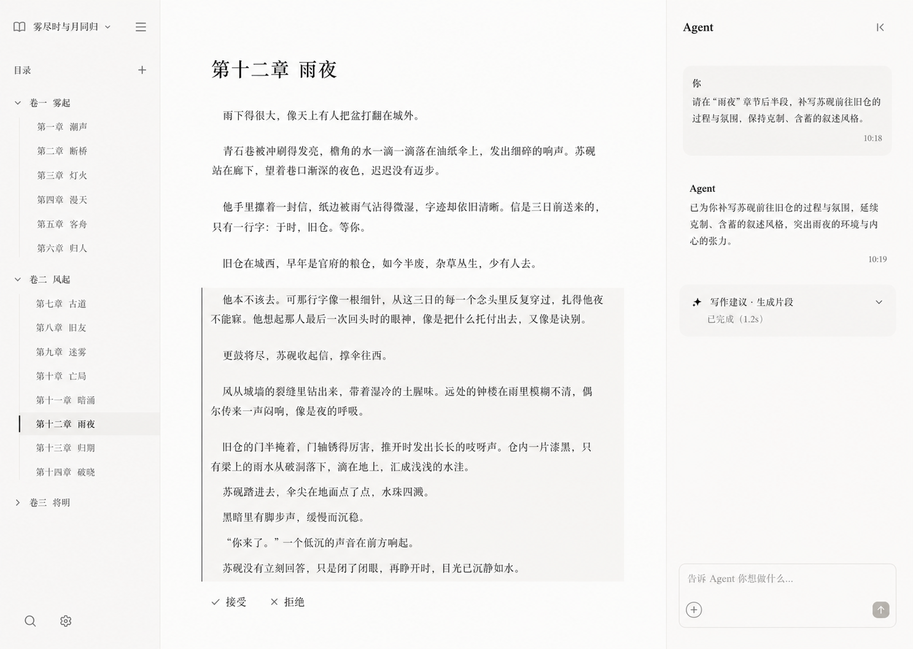

# StoryOS three-column writing workspace

## Status

- Approved by the author as the default visual reference on 2026-07-13.
- This artifact fixes the intended product direction; it is not proof that the interaction contract has been implemented or verified.
- The implementation must still be tested through [Validate the Editable Proposal Contract in Tiptap](https://github.com/FrankQDWang/StoryOS/issues/45) and the complete shell through [Prototype the Fixed Workspace Shell and Dynamic Surface Boundary](https://github.com/FrankQDWang/StoryOS/issues/55).

## Non-negotiable workspace structure

The primary writing workspace is a fixed three-column shell:

1. The left column is a hierarchical manuscript tree. A novel contains volumes, and each volume contains chapters. Volumes can be expanded and collapsed; the active chapter is visibly selected.
2. The center column is the manuscript editor. It is the authoritative surface for prose proposals, editing, acceptance, rejection, and conflict handling.
3. The right column is a normal Agent conversation panel. It contains the author-Agent transcript, compact tool or run summaries, and future transcript-native MCP Apps. The whole column can be collapsed.

## Proposal presentation

- A replacement or continuation is projected directly after the paragraph it affects, preserving reading order and local context.
- Proposed prose is editable in place before acceptance.
- The proposal block uses the approved restrained treatment: warm off-white canvas, charcoal type, pale warm-gray proposal surface, and a thin vertical marker.
- The author-facing actions are `接受` and `拒绝`.
- There is no visible diff comparison, `查看差异` action, or persistent Word-style tracked-change markup.
- Technical receipts, JSON, state grids, and debugging controls do not appear in the manuscript surface.

## Agent panel behavior

- Agent operations happen in the right conversation panel rather than in a separate workflow menu or editor-side control center.
- Requests and results read like a normal Agent conversation.
- Tool and run activity may appear as compact, inspectable transcript rows without displacing the conversation.
- A composer remains available at the bottom of the panel.
- Collapsing the panel gives the editor more room without changing the active manuscript or proposal state.

## Visual character

Use the reference image as the source of truth for the visual tone: quiet, literary, warm, spacious, and low-chrome. Preserve its off-white palette, dark neutral typography, subtle dividers, restrained selection states, and minimal controls. Do not turn the workspace into an IDE dashboard.

## Provenance

The reference was generated during the author-in-the-loop design exploration for StoryOS, then explicitly approved by the author for long-term reuse. It incorporates the preferred palette and proposal treatment from the first explored direction together with the volume-and-chapter hierarchy from the second.
