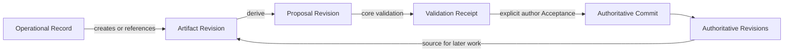

# Artifact and Authoritative-State Domain Model

- Status: accepted
- Wayfinder resolution: [Define the Authoritative-State and Artifact Domain Vocabulary](https://github.com/FrankQDWang/StoryOS/issues/44)
- Canonical glossary: [`CONTEXT.md`](../../CONTEXT.md)
- Related foundation specification: [Fiction Memory and Research Provenance Semantics](fiction-memory-and-research-provenance-semantics.md)
- Context and disclosure refinement: [Context Assembly, Retrieval, and Outbound Disclosure Semantics](context-assembly-retrieval-and-outbound-disclosure-semantics.md)
- Manuscript/Proposal refinement: [Manuscript Revision and Proposal State Machine](manuscript-revision-proposal-state-machine.md)
- Author-command evidence refinement: [Author Command Admission](author-command-admission.md)
- Browser-local continuity refinement: [Web Editor Session, Synchronization, and Recovery Semantics](web-editor-session-synchronization-and-recovery-semantics.md)
- Operational lifecycle refinement: [Run Event, Mailbox, Snapshot, Retention, and Archival Semantics](run-event-mailbox-snapshot-retention-and-archival-semantics.md)
- Ownership and deployment decision: [ADR 0004: Adopt a PostgreSQL Service and Project Isolation Boundary](../adr/0004-adopt-postgresql-service-and-project-isolation-boundary.md)

## 1. Purpose

This specification defines the durable domain language shared by the StoryOS editor, Agent Kernel, Tools, Skills, MCP integrations, transcript, and future Eval surface. It establishes:

- the boundary between author-owned truth and Agent-produced material;
- the Core Artifact families and the restricted extension surface;
- Artifact identity, revisions, provenance, lifecycle, and retention;
- the exact User and Project ownership boundary shared by all project-scoped objects;
- the only path by which a Proposal can affect Authoritative State;
- the distinction between Artifacts, authoritative domain objects, and operational execution records.

This document is normative for later foundation tickets. Later work may refine storage, wire formats, editor mechanics, and aggregate schemas, but it must preserve the invariants defined here or explicitly supersede this decision.

This specification alone owns the cross-domain classification of
Authoritative State, Artifacts, and Operational Records. The linked admission,
Manuscript/Proposal, and Web Editor Session contracts remain the sole owners of
their identities, fields, transition meaning, and browser-local recovery
behavior; this specification consumes those contracts without redefining them.

## 2. Three disjoint durable spaces

StoryOS has three disjoint kinds of durable object.

Every project-scoped member of all three spaces binds one trusted `ProjectScope { owner_user_id, project_id }`. An object, reference, query, command, cache, index, or projection with a missing or mismatched member of that pair is ineligible. A client-supplied owner, a process-global current User, a project path, or ProjectId alone never authorizes access. Globally reusable definitions may remain unscoped only when they contain no project-derived data or project authority.



### 2.1 Authoritative State

Authoritative State is the author-approved current truth of the project: prose, established fictional-world truth, characters, relationships, timeline, and manuscript structure.

- Authority is binary. There is no ordered `authority_level` such as draft, accepted, canon, or locked.
- Lifecycle, confidence, lock state, and repetition never make an object partially authoritative.
- An Artifact never becomes authoritative in place.
- Authoritative State changes only through a Direct Author Action, Acceptance, or an explicitly authorized safe compensation.

### 2.2 Artifacts

Artifacts are durable, typed content, evidence, proposals, or views that authors can inspect, edit, cite, derive, retain, archive, or remove as permitted by their kind. Source Snapshot payloads are immutable evidence; an Artifact may support or propose a change, but it owns no authoritative state.

### 2.3 Operational Records

Operational Records explain execution rather than product content. They include:

- `AgentRun` and `RunStep`;
- `RunPlan`;
- `ContextAssemblyManifest`;
- `ToolCall`;
- `Approval`;
- usage and cost records;
- `ArtifactLifecycleEvent`;
- `RunEvent`;
- `AuthorCommandAdmission` issuance, OutcomeUnknown, reconciliation, and
  terminal-settlement records;
- sanitized pre-admission refusal records;
- `EditorInputFence` and `AuthorActionRef`;
- every typed Receipt, including `DomainReceipt`, `ValidationReceipt`,
  `AcceptanceReceipt`, `UndoAcceptanceReceipt`, and `AuthorUndoReceipt`.

Operational Records may reference or produce Artifacts, but they do not inherit Artifact revision, derivation, retention, or Acceptance behavior.

`PlanDraft` is an Artifact. Adopting it for execution creates a distinct `RunPlan` Operational Record and preserves the source Draft.

### 2.4 Positive classification and ownership

The following table is the canonical cross-domain classification. “Producer”
names the component that may create the classified fact; a Receipt's separate
typed producer cause is closed in section 8.6.

| Concept | Positive class and lifecycle | Producer | Semantic owner |
| --- | --- | --- | --- |
| Authoritative State | Author-owned current truth projected from each authoritative object's immutable Revision Head; it has no Artifact or Operational Record lifecycle | StoryOS Core only, through the closed authority-changing transitions | this specification |
| `Artifact` | Durable typed content/evidence/view with immutable linear revisions, provenance, and the lifecycle owned by its Core family or safe extension envelope | one exact closed Artifact Creator | this specification |
| `Draft` | Non-authoritative Core Artifact with immutable revisions, common retention, and reversible `open \| closed` Draft closure | `Author \| AgentRunStep \| ToolCall \| CoreTransition \| EditorRecovery`, further restricted by Draft subtype | this specification |
| Operational Record | Durable execution/context/authorization/usage/validation/transition evidence with only its owning record's append-only or immutable lifecycle and no Artifact lifecycle | the exact StoryOS component named by the closed record type | this specification |
| `AuthorCommandAdmission` | Operational Record whose exact append-only lifecycle permits `pending` to reach `ReceiptSettled`, `RequiresReconfirmation`, or nonterminal `outcome_unknown`, which may repeat before one terminal settlement; pre-admission refusal is a separate immutable Operational Record and not an Admission state | StoryOS Server admission and reconciliation boundary | [Author Command Admission](author-command-admission.md) |
| `PreAdmissionRefusalRecord` | Immutable, bounded, sanitized Operational Record outside the Admission lifecycle; it positively proves that no Admission, Command, nonce consumption, Receipt, or Core effect exists | StoryOS Server pre-admission validation boundary | [Author Command Admission](author-command-admission.md) |
| `EditorInputFence` | Immutable Operational Record and automatic safety cause; it is recorded once and never receives an Author Action Sequence | StoryOS Host at the protected editor-input boundary; Core consumes the exact identity as its safety cause | [Manuscript Revision and Proposal State Machine](manuscript-revision-proposal-state-machine.md) |
| `AuthorActionRef` | Immutable Author Action Operational Record created only for a successfully committed author-owned Core Transition, with one Project Scope-local sequence and `Forward \| Compensation` disposition | StoryOS Core, atomically with the successful Transition | [Manuscript Revision and Proposal State Machine](manuscript-revision-proposal-state-machine.md) |
| typed Receipt | Immutable Operational Record for one Core validation or domain-command attempt; it has no Artifact revision, derivation, retention, or Acceptance lifecycle | StoryOS Core only | [Manuscript Revision and Proposal State Machine](manuscript-revision-proposal-state-machine.md) for the current closed Receipt kinds |
| `RefusedEditDraft` | `Draft` Core Artifact with Artifact revisions, common retention, and reversible Draft closure | the refused `ApplyAuthorEdit` Core Transition and its Receipt | [Manuscript Revision and Proposal State Machine](manuscript-revision-proposal-state-machine.md) |
| `RecoveryDraft` | `Draft` Core Artifact with Artifact revisions, common retention, and reversible Draft closure | StoryOS Host-assigned `EditorRecovery` bound to one exact Editor Session, writer generation, complete recovered intent, and journal, admission-settlement, takeover, or in-memory recovery evidence as applicable | [Web Editor Session, Synchronization, and Recovery Semantics](web-editor-session-synchronization-and-recovery-semantics.md) |
| `ProposalConflict` | The `conflicted` condition on an exact Proposal Revision's validation axis, projected from immutable Core Receipt/Event evidence; the condition is not a fourth durable space, another Artifact, or the Operational Record that detected it | StoryOS Core validation or target-drift detection | [Manuscript Revision and Proposal State Machine](manuscript-revision-proposal-state-machine.md) |
| `Proposal` | `Proposal` Core Artifact with immutable revisions, retention, and the orthogonal generation, validation, closure, and per-Operation resolution axes | `Author \| AgentRunStep \| ToolCall`, plus `CoreTransition` only for a typed Reversal Proposal | [Manuscript Revision and Proposal State Machine](manuscript-revision-proposal-state-machine.md) |
| `AuthoritativeRevision` | Immutable version of an authoritative domain object in Authoritative State, guarded by an expected prior Revision and selected through current Heads | StoryOS Core in a committed Direct Author Action, Acceptance, or safe compensation | [Manuscript Revision and Proposal State Machine](manuscript-revision-proposal-state-machine.md) |
| `Acceptance` | Author-admitted Core command and attempt over one exact eligible Proposal Revision; its durable admission, Command, Author Action when applied, and Receipt evidence are Operational Records, while its result may create new Authoritative Revisions | StoryOS Core under one exact Author Command Admission | [Manuscript Revision and Proposal State Machine](manuscript-revision-proposal-state-machine.md) |

Admission permits one exact Core command evaluation but is neither an Artifact,
creative Authoritative State, nor reusable authorization. A browser event,
Agent output, Tool or MCP result, App View, Local Edit Journal entry, Pending
Edit Projection, Draft, Proposal, Operational Record, or repeated observation
never becomes authoritative merely by existing. Only the Core transitions
named above can append Authoritative Revisions.

## 3. Artifact type system

### 3.1 Stable Core Artifact families

The top-level Core Artifact families are closed and stable:

```text
Message
Proposal
Candidate
Draft
ResearchArtifact
AnalysisReport
ToolArtifact
AppViewArtifact
```

Domain growth normally adds a closed subtype inside a family instead of adding a new top-level lifecycle model.

Initial closed subtypes include:

```text
ProposalKind
├── InlineEditProposal
├── BlockEditProposal
├── CharacterChangeProposal
├── RelationshipChangeProposal
├── TimelineChangeProposal
├── CanonChangeProposal
├── ReversalProposal
└── ProposalBundle

CandidateKind
├── FictionAssertionCandidate
├── InferredPreference
└── OperationalLesson

DraftKind
├── PlanDraft
├── RefusedEditDraft
└── RecoveryDraft

ResearchArtifactKind
├── ExternalSourceSnapshot
├── ImportedSourceSnapshot
├── ResearchNote
└── ResearchSynthesis
```

One Candidate represents one independently reviewable semantic candidate. A batch extraction creates multiple Candidate Artifacts and may create an Analysis Report that organizes them.

### 3.2 Extension Artifacts

Only `ToolArtifact` and `AppViewArtifact` may carry a restricted namespaced extension schema.

An Extension Artifact Revision identifies at least:

```text
namespace
type_name
schema_version
schema_digest
producer_id
producer_version
canonical_payload
static_fallback?
```

Extension rules:

- an extension cannot register an authoritative write or Acceptance handler;
- unknown-schema payloads are never executed, cannot invoke Tools, cannot source or produce Proposals, and cannot validate or participate in Acceptance;
- only a known, enabled schema may request that the Host create a StoryOS Core Proposal;
- when the producer or renderer is unavailable, the Host preserves and exports the canonical payload and uses a safe generic read-only view or static fallback;
- a compatible schema migration within the same namespace, type, and semantic identity appends a new revision and preserves the old revision;
- a migration that changes namespace, type, or semantic identity creates a new derived Artifact identity;
- reinstalling a matching extension may restore specialized presentation;
- changing Authoritative State always requires a StoryOS Core Proposal and domain command.

### 3.3 Prefer the most specific Core Artifact

A ToolCall that produces a domain-recognized durable result creates the most specific Core Artifact with the ToolCall as Creator. It does not also create a duplicate Tool Artifact wrapper.

`ToolArtifact` is reserved for durable Tool or Service output that has no more specific Core Artifact family, or for a permitted namespaced extension payload. Raw invocation parameters, transient output, errors, and execution status remain on the ToolCall Operational Record.

## 4. Artifact identity and revisions

### 4.1 Stable logical identity

An Artifact has a stable logical identity. Its revisions form one linear history.

- a revision write carries `expected_revision_id`;
- a mismatched expected revision fails instead of using last-write-wins;
- an alternative interpretation or edit becomes a new derived Artifact identity;
- a merge creates a new Artifact that references every exact source revision;
- the provenance graph across Artifact identities may form a DAG, but one Artifact's revision chain does not branch.

### 4.2 Immutable Artifact Revisions

Each Artifact Revision is an immutable snapshot of content and provenance. A conceptual envelope contains:

```text
project_scope {
  owner_user_id
  project_id
}
artifact_id
artifact_revision_id
artifact_kind
schema_version
parent_revision_id?
created_at
creator
content_digest
payload_ref
provenance_edges[]
```

Every derivation, validation, Message reference, and Acceptance pins an exact Artifact Revision. A mutable `latest` alias may support current UI queries but is never persisted as historical evidence.

### 4.3 Content digest is not identity

Two runs that independently produce identical bytes retain different Artifact and Revision identities because their creator, cause, time, and provenance differ. Their immutable payloads may point to the same content-addressed blob.

The digest provides integrity and physical deduplication. It never supplies semantic identity.

## 5. Provenance

### 5.1 Required revision provenance

Every Artifact Revision is independently explainable without replaying an Agent Run. It records:

```text
project_scope {
  owner_user_id
  project_id
}
artifact_id
artifact_revision_id
artifact_kind
schema_version
created_at
creator
source_refs / provenance_edges
content_digest
```

`creator` is a closed discriminated union:

```text
Author {
  user_id
  author_command_admission_id
}
AgentRunStep { run_step_id }
ToolCall { tool_call_id }
Import { operational_record_ref }
CoreTransition { receipt_ref }
EditorRecovery {
  editor_session_id
  writer_generation
  recovery_evidence_ref
}
```

Each revision has one direct Creator. There is no generic `System`, browser,
model, MCP, extension, or local-projection Creator: MCP and extension
production resolves through `ToolCall`; model production resolves through
`AgentRunStep`; author production binds the exact Author Command Admission;
Core-produced recovery or refusal Artifacts bind the exact Receipt or recovery
Operational Record. `RefusedEditDraft` uses `CoreTransition`, while a durably
created `RecoveryDraft` uses Host-assigned `EditorRecovery`, whose evidence
reference binds the complete journal, admission settlement, takeover, or
in-memory recovery boundary owned by the Web Editor Session contract. If an
author edits an Agent-produced revision, the new revision's Creator is the
Author and a `derived_from` edge preserves the Agent-produced source.
Contributor history is derived from the provenance graph rather than stored as
a mutable list.

Creator eligibility remains subtype-specific. `Import` creates imported source
Artifacts, never a Proposal; `EditorRecovery` creates only a
`RecoveryDraft`; and `CoreTransition` creates only the exact Core Artifact
named by its Receipt, including `RefusedEditDraft` and `ReversalProposal`.

### 5.2 Typed provenance edges

Each edge has a role, exact target reference, and optional locator or claim references:

```text
role
target_ref
locator?
claim_refs?
```

Core roles are:

| Role | Meaning |
|---|---|
| `derived_from` | The revision directly transforms or edits the target. |
| `supported_by` | The target provides evidence for identified claims or findings. |
| `opposed_by` | The target provides counterevidence against identified claims or findings. |
| `qualified_by` | The target limits or conditions identified claims or findings. |
| `available_as_context` | The target was available to the generating step; this does not claim the model used it as evidence. |
| `responds_to` | The revision answers a Message, author instruction, or goal. |

Targets pin an exact Artifact Revision, Authoritative Revision, selection snapshot, external-source snapshot, or Context Assembly Manifest as appropriate. StoryOS never collapses “was visible to the model” and “supports this claim” into the same relation.

### 5.3 Source snapshots and structured conclusions

An external source is preserved as an immutable `ExternalSourceSnapshot` Research Artifact rather than a live URL. It records the original URL, title and source identity, retrieval time, MIME type, parser version where applicable, content digest, content-addressed payload, and available page or section locators. Re-fetching creates a new Snapshot; annotations and corrections create a derived Research Note or Synthesis. An imported file becomes an immutable `ImportedSourceSnapshot` with corresponding import provenance.

A `ResearchSynthesis` combines a human-readable document with stable `claims[]`. An `AnalysisReport` combines a human-readable document with stable `findings[]`. Claim and Finding IDs remain mappable across revisions and expose category, summary, target references, evidence references, and suggested Candidate references. A single Claim or Finding may independently derive a Candidate or Proposal, but remains non-authoritative.

## 6. Artifact lifecycle

### 6.1 Content revisions and lifecycle events are separate

A content or provenance change creates an Artifact Revision. A state transition creates an `ArtifactLifecycleEvent` tied to an exact revision, actor, reason, and time, and updates a current-state projection. A status-only transition does not duplicate unchanged content into a new revision.

### 6.2 Common retention state

All Artifacts share one independent retention axis:

| State | Meaning |
|---|---|
| `retained` | Content is present and normally available. |
| `archived` | Content remains available from history but is excluded from normal retrieval and context. |
| `tombstoned` | Content is removed from use and only a minimum non-content audit record remains. |

Candidate, Draft, and Proposal workflow never grants authority and does not replace this retention axis.

### 6.3 Candidate and Draft closure

Candidate and Draft use a simple reversible `open | closed` closure. A close event records exactly one closed reason from `dismissed | superseded | abandoned`.

Deriving a Proposal does not close the source Candidate or Draft. One source may produce multiple Proposals. Supersession is an explicit provenance relationship and does not rewrite either history.

Messages, Research Artifacts, Analysis Reports, Tool Artifacts, and App View Artifacts have no type-specific workflow; they use revisions, provenance, supersession where needed, and the common retention axis.

### 6.4 Proposal state axes

A Proposal uses orthogonal state axes rather than one combinatorial enum:

```text
generation:
  generating | ready_partial | ready

validation:
  pending | valid | invalid | conflicted

operation resolution:
  pending | applied | rejected

closure:
  open | withdrawn | superseded
```

`partially_resolved` and `resolved` are derived from the stable Proposal Operations rather than persisted as additional states.

`ready_partial` preserves content after generation stops before intended completion. It remains editable but cannot be accepted until the author explicitly completes the current content or generation finishes and Core validation succeeds.

A Ready Partial Proposal may resume generation from its current revision or regenerate into a new revision. An author may explicitly complete the current partial content, transitioning the resulting revision to `ready` before validation.

A conflict means the target, base version, or preconditions no longer hold. StoryOS does not silently rebase or merge a conflicted Proposal.

The single Acceptance-eligibility predicate for an exact Proposal Revision is:

```text
retention == retained
generation == ready
validation == valid for this revision and current target versions
closure == open
every selected operation == pending
```

Creating a content revision resets validation to `pending`. Any change to a referenced target Authoritative Revision does not mutate the old Validation Receipt; it makes that Receipt non-current and projects the old Proposal Revision as `conflicted`. Regaining eligibility requires an explicitly replanned new Proposal Revision against current targets.

### 6.5 Stable Proposal Operations

A Proposal Operation is a stable author decision unit. It is not a visual diff hunk.

- dynamic character/word hunks remain derived presentation;
- pending operations may evolve in a new Proposal Revision;
- when target and semantic identity are unchanged, the operation retains its ID;
- changing the operation's target or meaning closes the old operation and creates a new ID;
- applied and rejected incarnations are permanently frozen against the exact revision that resolved them;
- reopening a rejected operation creates a new Proposal Revision with the same operation ID only when target and semantic identity are unchanged, and resets validation to `pending`;
- editing remaining pending operations after partial resolution creates a new Proposal Revision and requires validation again.

One Proposal has exactly one active writer. Agent generation owns the write while `generating`; author input atomically pauses that writer, preserves the partial revision, transitions to `ready_partial`, and gives authorship priority. Concurrent writes fail through expected-revision checking.

## 7. Proposal contract

### 7.1 Only Proposals cross the authority boundary

An Artifact is eligible for Acceptance only when it is a StoryOS Core Proposal containing:

- typed domain operations;
- exact target identities and base versions;
- explicit preconditions;
- an inspectable preview of expected effects;
- a current Core `ValidationReceipt`.

The exact revision must also satisfy the complete `retained + ready + valid + open` predicate, and every selected operation must be pending.

Messages, Candidates, Drafts, Research Artifacts, Analysis Reports, Tool Artifacts, App View Artifacts, and Extension Artifacts cannot be accepted directly. They may request or source a new Proposal.

`derive_proposal` creates a new Proposal identity referencing exact source revisions. It never mutates a Candidate or Draft into another kind.

### 7.2 Proposal Bundles

Cross-domain intent uses a non-nestable `ProposalBundle` that references exact child Proposal revisions without copying their operations. Each child remains domain-specific and is reviewed in its native UI.

A Bundle contains stable, non-nested Bundle Entries. Each entry is represented as a Bundle-level Proposal Operation and references an exact child Proposal Revision, the selected child operation IDs, and its predecessor entry IDs without copying child payloads.

A Bundle declares one execution policy:

| Policy | Meaning |
|---|---|
| `atomic` | All selected child effects succeed or none apply. |
| `ordered_independent` | Children are handled independently in an explicit dependency order. |

For `atomic`, every selected entry validates before one transaction and all effects succeed or none apply. For `ordered_independent`, entries execute in dependency order using deterministic per-entry idempotency keys; execution stops on the first failure, successful child Receipts and their Commits remain committed, and unexecuted entries remain pending. The original idempotency key is bound to the original command digest and always returns that immutable attempt result; reusing it with a different digest is a conflict. Continuing a partial Bundle uses a new key, selects only pending entries, links the new attempt Receipt to the prior one, and skips entries already proven successful. Aggregate Bundle progress is derived across all linked attempt and child Receipts.

### 7.3 Core validation

Only StoryOS Core can produce a `ValidationReceipt`. A Proposal creator, model, Skill, Tool, MCP server, or extension may request validation but cannot assert validity.

A Validation Receipt pins:

```text
proposal_revision_id
target_versions
schema_checks
domain_invariants
precondition_results
validated_at
validator_version
```

Changing Proposal content or a relevant target never mutates the historical Receipt. New Proposal content creates a new `pending` Revision; a changed referenced target projects the old Revision as `conflicted` until explicit replan creates another pending Revision. Acceptance rechecks the current Receipt, target versions, permission, Anchors, digests, and preconditions to prevent time-of-check/time-of-use gaps. Extension-provided checks are advisory only.

## 8. Authority-changing commands

### 8.1 Direct Author Actions

An author may directly change Authoritative State without a Proposal only when the command is caused by the author's own editor input path and the operation is:

- caused by the author's current direct manipulation;
- deterministic and immediately visible;
- limited to one exact target under direct manipulation;
- reversible through authoritative revision history.

Typing, deleting, manually pasting, and moving a directly manipulated block qualify. Bulk, cross-location, or not-fully-previsible transformations remain Proposal-gated even when implemented by StoryOS Core and initiated by an author click. An Agent-, Tool-, MCP-, or extension-issued insertion command is likewise Proposal-gated. The causal command path and scope, not the textual origin alone, define the boundary.

All editor input enters Core through one `ApplyAuthorEdit` command. Core recomputes ownership from durable Heads and Proposal Anchors and returns one whole-command result: authoritative applied, Proposal revised, refused to Draft, conflicted, or no effect. The client cannot select an authoritative or Proposal write route, and one mixed-ownership input is never split.

### 8.2 Acceptance

The external command surface for a domain Proposal uses the selected envelope:

```text
AcceptProposal {
  command_schema_version
  project_scope
  proposal_id
  proposal_revision_id
  validation_receipt_id
  selected_operation_ids
  expected_target_revisions
  author_command_admission_id
  idempotency_key
}
```

`project_scope` contains `owner_user_id` and `project_id`, which must match the trusted requester and the Proposal's immutable Project Scope. Both identities participate in the command digest and idempotency boundary but do not let a client assert ownership. Every referenced Proposal, Receipt, target Revision, and selected Operation must resolve under that same scope before validation or mutation.

StoryOS Core dispatches to a handler selected by closed `ProposalKind`. Extensions cannot register Acceptance handlers. An idempotency key is permanently bound to one command digest: an exact retry returns the existing attempt Receipt, while the same key with different input fails.

For a domain Proposal, the selected operations are atomic: all succeed or none apply. Bundle Entries are Bundle-level operations, so the same `selected_operation_ids` field selects them; their child-operation selections are pinned inside the exact Bundle Revision. Bundle entries then obey the declared `atomic` or `ordered_independent` policy, and each child Acceptance remains individually atomic. The handler revalidates the exact revisions, complete eligibility predicate, targets, permission, and preconditions, produces the required Authoritative Revisions and Commit records, records lifecycle events, and returns an immutable Acceptance Receipt. Reusing an idempotency key returns the existing result without applying effects again.

### 8.3 Reject, withdraw, supersede, and reopen

- `RejectProposalOperations` is an author decision over selected pending operations and preserves a typed reason.
- `WithdrawProposal` removes an active Proposal from review without representing an author rejection.
- `SupersedeProposal` links the replacing and replaced Proposals and prevents Acceptance of the old Proposal.
- rejected historical incarnations never change; reopen creates a new Proposal Revision, preserves the operation ID only when target and semantic identity are unchanged, resets validation to pending, and then requires Core validation.
- applied operations cannot use reopen; they require Undo Acceptance or a new Reversal Proposal.

### 8.4 Undo Acceptance

`UndoAcceptance` takes an Acceptance Receipt identity, exact current target Revisions, expected Proposal head, Author Command Admission, and an idempotency key.

Direct compensation is allowed only when the Acceptance is the current Author Undo Frontier, has not already been compensated, and every affected target's current Head and payload digest exactly match the resulting Authoritative Revision in the Acceptance Receipt. It atomically:

- creates compensating Authoritative Revisions and an Authoritative Commit;
- appends a new Proposal Revision preserving the accepted content against the compensated base only when the Proposal still has a safe linear head;
- reopens the corresponding operations as pending;
- preserves the original Acceptance Receipt and creates an immutable Undo Acceptance Receipt.

When the Proposal head advanced incompatibly, was withdrawn or superseded, StoryOS creates a new derived Proposal identity instead of branching history without blocking otherwise safe authoritative compensation. Any non-exact authoritative target Head, including an apparently non-overlapping later change, forbids direct compensation and derives a `ReversalProposal` against current Authoritative State when possible. If required evidence was tombstoned or is unsupported, the outcome is unavailable.

### 8.5 Unified author undo order

Every successfully committed author-owned Core Transition receives one Project Scope-local `AuthorActionSequence`, independent of `AuthoritativeCommit.sequence`. Automatic producer, validation, and input-safety transitions may be visible but do not become author actions merely because an Author Command Admission caused or preceded them. Each author action is either a `Forward` action carrying a typed reversible or Barrier disposition, or a `Compensation` naming the exact earlier Forward action it settled. The derived Author Undo Frontier is the latest Forward action not named by a successful Compensation; Compensation entries remain auditable but are never undo candidates, and at most one may name a given source. `UndoLatestAuthorAction` names that exact Frontier and routes through its registered typed Core handler; a mismatch conflicts and a Barrier stops undo without skipping to older work. A Reversal Proposal is a new Forward action and does not compensate its source. ProseMirror history remains a session-local inverse candidate rather than ordering truth, and reapplication is always a fresh Forward domain command rather than generic durable redo.

### 8.6 Typed Receipts

Every typed Receipt is an immutable StoryOS Core Operational Record, not an
Artifact. A Receipt records one Core validation or domain-command attempt,
including attempts that are refused, redirected, or make no Authoritative
State change. The current closed kinds are `DomainReceipt`,
`ValidationReceipt`, `AcceptanceReceipt`, `UndoAcceptanceReceipt`, and
`AuthorUndoReceipt`; their strongly typed identities are never collapsed into
`DomainReceiptId` or an opaque fallback. StoryOS Core is the only Receipt
producer. Every Receipt separately links one exact exhaustive producer cause:

```text
ProducerCause =
  AuthorCommandAdmission { author_command_admission_id }
  | EditorInputFence { editor_input_fence_id }
  | AgentRunStep { run_step_id }
  | ToolCall { tool_call_id }
```

MCP servers and extensions cause Core work only through `ToolCall`; models
cause it only through a validated `AgentRunStep`. Browser events, Client
Sessions, local projections, journal entries, Artifacts, generic `System`
actors, and raw external results are not producer-cause variants. A new variant
is a coordinated contract change owned by the Manuscript/Proposal state
machine, not an untyped fallback.

An Acceptance Receipt records one attempt's command digest and idempotency key, exact Proposal Revision, Validation Receipt, selected operations, expected targets, prior and resulting Authoritative Revisions, zero or more Authoritative Commit references, child Receipts, and the exhaustive `Applied | Invalid | Conflicted | Refused | NoEffect` result. An Undo Acceptance Receipt records the original Acceptance Receipt, command digest, idempotency key, and an outcome union:

```text
Compensated { authoritative_commit_ref, proposal_ref? }
ReversalRequired { reversal_proposal_ref }
Unavailable { reason }
```

Receipts are displayable in the Run Timeline and future Eval surface, but they cannot be revised, derived, accepted, archived, or tombstoned as content.

## 9. Authoritative revision model

Each authoritative domain object has a stable identity and immutable linear Authoritative Revisions guarded by an expected prior revision.

Every author-authorized domain transaction also creates one Project Scope-ordered `AuthoritativeCommit` containing:

- a monotonic sequence local to the exact Project Scope;
- actor and cause;
- all prior and resulting Authoritative Revision references;
- the associated Direct Author Action, Acceptance Receipt, or an Undo Acceptance Receipt whose outcome is `Compensated`.

This provides precise object conflict checks and a single atomic Project Scope order without creating a complete project snapshot for every edit. Current Authoritative State is a projection over each object's current revision.

## 10. Specialized Artifact behavior

### 10.1 Messages

A Message contains visible text blocks and exact Artifact Revision references with display roles and optional presentation hints. A presentation hint can affect rendering only, never Artifact semantics. A new Artifact Revision appears through a new Message or an explicit Message replacement relation; it never rewrites an existing Message or resolves a mutable latest revision during replay.

An archived Artifact remains inspectable through historical Messages. A tombstoned reference renders an explicit deleted placeholder.

### 10.2 Tool Artifacts

Tool Artifacts contain only durable outputs that lack a more specific Core Artifact family or permitted extension schemas. Tool origin does not provide authority, validity, or Acceptance capability.

### 10.3 App View Artifacts

An App View Artifact is a reproducible View Descriptor whose immutable Revisions use
the `Prepared | Terminal` stages defined by
[ADR 0002](../adr/0002-specify-transcript-and-mcp-app-lifecycle-semantics.md).
Each Revision contains or references:

```text
app_ui_resource_revision_ref
protocol_profile
app_view_capability_snapshot_ref
input_artifact_revision_refs[]
authorized_host_context_snapshot
persisted_view_state?
stage:
  Prepared { app_view_prepared_receipt_ref }
  Terminal { terminal_outcome_ref, app_static_fallback }
```

The Prepared Receipt is a minimal Operational Record rather than a rich fallback. A
Terminal Revision cannot be exposed through a Message until its safe StoryOS-rendered
static fallback is durable and valid. Persisted view state conforms to a declared
versioned schema. StoryOS does not persist a live DOM, JavaScript heap, cookies,
temporary credentials, arbitrary local storage, or pending bridge callbacks.

Every iframe or renderer is a disposable App View Instance bound to one exact
Revision. Reload and reconnect create a new Instance and never re-execute the
originating ToolCall. App actions enter through a durable App Action Request and the
normal Host command, AgentRun, Tool Gateway, Proposal, and Acceptance boundaries;
they never inherit the originating Run's authority, mutate authoritative domain data,
or rewrite a historical App View Revision.

`authorized_host_context_snapshot` contains only non-sensitive values actually
authorized and disclosed for that specific App invocation; it is not a copy of global
Host state.

## 11. Retention, deletion, and provenance gaps

`ArchiveArtifact` is reversible and excludes the Artifact from normal retrieval and model context while retaining its payload.

`TombstoneArtifact` is terminal. It removes the Artifact's owned payload, indexes, and derived caches, including captured source content when the Artifact is itself a Source Snapshot. It never deletes separately referenced source Artifacts or a content-addressed blob still referenced by another logical Artifact. It retains a minimum tombstone for every former Revision: Project Scope, artifact ID, revision ID, parent revision ID, kind, creation time, digest, deletion actor/time/reason, and necessary relationship structure.

Immutable inbound Provenance Edges never change. When an edge resolves to a Revision Tombstone, the read projection renders a `PurgedSourceRef` and states that the source was removed and can no longer be verified. Tombstoning a source does not automatically change or delete Authoritative State. Reversing authoritative effects requires Undo Acceptance or a new Proposal.

Run and Subrun operational retention is independent of this Artifact axis and is
governed by [Run Event, Mailbox, Snapshot, Retention, and Archival
Semantics](run-event-mailbox-snapshot-retention-and-archival-semantics.md). It
cannot convert operational compaction into an Artifact Tombstone or delete
author-owned creative state.

## 12. Normative invariants

1. An Artifact never becomes Authoritative State in place.
2. There is no numeric or ordered authority level.
3. Only a valid StoryOS Core Proposal can be accepted.
4. Extensions cannot define authoritative writes, Proposal kinds, validators, or Acceptance handlers.
5. Direct Author Actions are narrow, deterministic, visible, and author-controlled; generated or opaque changes are Proposal-gated.
6. Every historical reference pins an exact revision or snapshot.
7. Every Artifact Revision is independently attributable without replaying a Run log.
8. Context availability is not evidentiary support.
9. Content digest is not logical identity.
10. One Artifact has one linear revision history; alternatives are derived Artifacts.
11. Content revisions and lifecycle events are distinct.
12. Applied and rejected Proposal Operations remain bound to their resolving revision.
13. Validation is Core-owned and scoped to exact Proposal and target versions.
14. Acceptance requires the exact retained, ready, valid, open revision and pending selections; it is author-authorized, idempotent, and revalidated, with domain operations atomic and Bundles governed by their explicit policy.
15. Undo never overwrites later conflicting author work.
16. Tombstoning a source makes the provenance gap explicit and never cascades into silent authoritative deletion.
17. Typed Receipts are Operational Records, not Artifacts.
18. Transcript Messages never rewrite history by resolving mutable latest Artifact revisions.
19. Every project-scoped durable object, reference, command, idempotency record, index, cache, and read projection binds and validates one exact Project Scope.
20. No cross-Project Scope reference, join, retrieval result, cache reuse, or disclosure is valid merely because an opaque ID or content digest matches.
21. Admission issuance, pre-admission refusal, OutcomeUnknown, reconciliation, terminal settlement, Editor Input Fences, Author Actions, and typed Receipts remain Operational Records; none can be promoted into Authoritative State or reused as authority.
22. `RefusedEditDraft` and `RecoveryDraft` are Draft Artifacts; their payload existence never proves or applies an author-owned Core Transition.
23. Proposal Conflict is a validation-axis condition projected from Core evidence, never a new Artifact, Receipt, or authority state.
24. Artifact Creator and Core `ProducerCause` are separate closed unions with no generic `System`, browser, model, MCP, extension, or local-projection fallback.

## 13. Deferred to later Wayfinder tickets

This decision intentionally does not choose:

- Rust structs, serialization libraries, database tables, indexes, or wire encodings;
- exact manuscript anchors, ProseMirror mappings, and editor transaction mechanics;
- exact fictional-world truth, character, relationship, timeline, and memory aggregate schemas;
- MCP Apps bridge methods, CSP details, iframe lifecycle, and protocol negotiation;
- Tool capability and Approval policy implementation;
- transactional crash consistency across PostgreSQL and any separately stored payloads;
- context ranking, retrieval algorithms, or provider disclosure rules;
- protocol versioning and generated TypeScript/OpenAPI tooling;
- final test matrix and performance budgets.

Those decisions belong to their existing dependent Wayfinder tickets and must consume this specification as an input.
