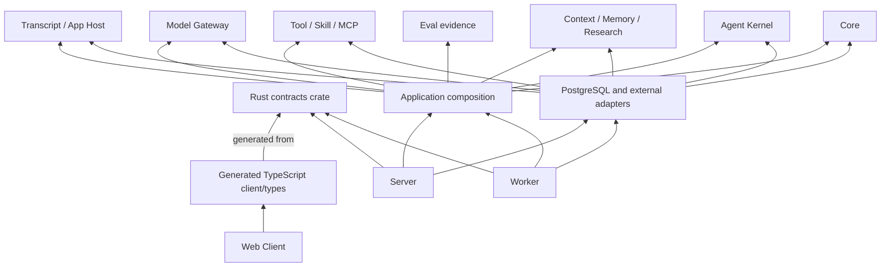

# Modular-Monolith and Repository Governance Boundaries

- Status: accepted
- Wayfinder resolution: [Define the Modular-Monolith and Repository Governance Boundaries](https://github.com/FrankQDWang/StoryOS/issues/59)
- Canonical glossary: [`CONTEXT.md`](../../CONTEXT.md)
- Repository-wide rules: [`AGENTS.md`](../../AGENTS.md)
- Related decisions: [ADR 0004](../adr/0004-adopt-postgresql-service-and-project-isolation-boundary.md), [ADR 0005](../adr/0005-require-ordered-context-assembly-before-destination-disclosure.md), [ADR 0006](../adr/0006-adopt-foundation-monorepo-governance.md), and [ADR 0007](../adr/0007-preserve-process-separable-server-worker-boundary.md)

## 1. Purpose and authority

This specification fixes the ownership, dependency, repository, and governance
boundaries for the StoryOS Foundation modular monolith. It turns the accepted
domain, storage, protocol, trust, and interaction contracts into a structure
that can evolve without turning a Rust crate, package, worker, adapter, or
prototype into a second source of creative authority.

It is normative for later implementation planning. It does not scaffold a Rust
workspace, Web Client, database, generator, CI pipeline, deployment, or test
suite. It does not select a production process manager, cloud topology, broker,
or first vertical slice.

The following inputs are settled and are not reopened here:

- StoryOS is one novel-project-scoped Discovery-Writing Agent Loop. It does
  not create an Agent-authored outline, an Author Plan, or fixed task-specific
  workflow runtimes.
- Authoritative State changes only through narrow deterministic direct author
  actions or an inspectable Core Proposal accepted by the Project Author.
- PostgreSQL is authoritative. Every project-bearing fact, operation, cache,
  index, context decision, and disclosure binds the exact Project Scope.
- Public product contracts are versioned HTTP Commands and Queries plus one
  replayable Project Activity SSE surface. The Rust contracts crate is their
  sole editable source and generates OpenAPI, JSON Schema, and TypeScript
  client/types.
- Model, embedding, Tool, MCP, and research processing is provider-neutral,
  external, minimum-necessary, and governed by existing destination, grant,
  compatibility, context, and disclosure contracts. Bailian is only a current
  test Provider.
- Transcript MCP Apps are sandboxed views/controllers over StoryOS-owned typed
  Artifacts. Proposal editing, Acceptance, rejection, and conflicts remain in
  the editor.

## 2. Governing decisions

### 2.1 Foundation Monorepo

The Foundation uses one repository for the Rust workspace, production Web
Client, contracts source, checked-in generated contract artifacts,
documentation, and frozen Prototype Evidence Assets. A compatible product
change is reviewed and reproduced as one unit.

The contracts crate is the only editable source for external contract shapes.
Generated artifacts are reviewed and checked in but are never independently
edited or treated as a second contract authority. This is a repository
boundary, not an author setting or a claim that every crate is published
independently.

### 2.2 Process-separable Server and Worker

Server and Worker are independently startable and deployable units of the same
modular monolith. The Foundation Validation Deployment may co-locate them for
a zero-configuration local experience. Co-location never permits an HTTP
request, in-process background task, or browser state to bypass the durable
outbox, lease, fence, idempotency, manifest-before-egress, or OutcomeUnknown
boundaries.

This is not a microservice split. Server and Worker share one repository, one
canonical PostgreSQL authority, one contracts version, and one governed
deployment. No broker, worker-private database, or internal HTTP API is a
source of truth.

### 2.3 Prototype Evidence Assets

`prototypes/**` contains frozen, disposable evidence assets. Each prototype
states its bounded question, exact commands, environment or lockfile,
observations, limitations, and the accepted contract it informed. A prototype
may be rerun to inspect or reproduce that evidence, but is not a production
source tree and must not be evolved into one.

No production workspace, dependency graph, build, test, package, release, or
runtime may include a prototype. Production code independently implements the
accepted contract; copying a prototype implementation, in-memory store, or
browser state machine does not establish that contract. Deletion is permitted
only by an explicit reviewable decision after a sufficient durable evidence
record remains.

### 2.4 Reference evidence and local snapshots

`.reference/codex` remains the tracked, commit-pinned, read-only upstream
reference allowed by repository rules. It is evidence only, not a Cargo or npm
workspace member, dependency, build input, test input, package, release, or
runtime component.

Any other `.reference/**` material is machine-local exploration unless it is
independently identified by a **Reference Evidence Locator** outside that
directory. A Locator records the canonical upstream URL, exact immutable
revision or digest, license, retrieval date, and relevant scope. Untracked or
modified local snapshots are never committed, cited as accepted evidence,
packaged, or made reproducibility prerequisites.

## 3. Ownership zones

The Foundation is one deployable system with explicit ownership zones. A zone
owns its domain language, invariants, ports, and contract changes; it does not
own every mechanism convenient to its current caller.

| Zone | Owns | Must not own |
| --- | --- | --- |
| **Contracts** | External HTTP/SSE DTOs, public schema/protocol identifiers, compatibility profiles, public limits, generated-contract metadata, and persisted/cross-process DTOs needing a stable wire owner | Domain truth, SQL rows, provider SDK behavior, browser state, or manually edited generated artifacts |
| **Core** | Project-Scoped domain commands, Authoritative State, Core Proposals, Acceptance, immutable Revisions, Receipts, and domain-owned transactional outcomes | HTTP, cookies, SQL/RLS syntax, Provider/MCP SDKs, queues, DOM, or UI workflow state |
| **Agent Kernel** | The general project-scoped Agent Loop, AgentRun/Subrun orchestration, plans, budgets, waits, finalization, causal execution records, and Kernel-owned ports | Novel-outline policy, direct authoritative writes, provider implementation, or a task-specific workflow runtime |
| **Context, Memory, and Research** | Operation Requirement, context gates, retrieval/projection policy, manifests, Memory/Research semantics, source/disclosure eligibility, and author inspection/control semantics | Hidden truth, direct Provider I/O, a global cache namespace, or implicit author instructions |
| **Tool, Skill, and MCP** | ToolSpec, SkillPackage, Registration, Capability/Approval semantics, Tool Gateway policy, MCP trust, and App-action ingress | A second Agent runtime, direct authority mutation, ambient project context, or raw client authority |
| **Model Gateway** | Provider-neutral registration, routing, route decisions, Invocation/Attempt semantics, capability mapping, recovery, and fallback policy | Provider-selected authority, secret storage, ambient context, or a permanent Bailian dependency |
| **Transcript and App Host** | Message projections, App View Artifacts, resource/instance lifecycle, sandbox mediation, static fallbacks, and App action routing | App-owned canonical state, iframe/DOM persistence, direct Tool invocation, or editor Proposal handling |
| **Eval evidence** | Typed evidence projections and evaluation-facing interpretation contracts that remain advisory | A main-writing workflow, hidden scoring authority, or a replacement for durable Run/Artifact evidence |
| **Application composition** | Use-case coordination, trusted request-context propagation, transaction intent, and port assembly | New domain authority, a shared dumping ground, or adapter-specific policy rewrite |
| **Adapters** | Concrete PostgreSQL, Provider, Tool/MCP, secret-resolver, research-fetch, telemetry, filesystem, and browser mechanics for owner-defined ports | Business/domain policy, new authority paths, a public API, or independently selected Project Scope |
| **Server** | Versioned HTTP/SSE transport, trusted requester/session admission, public DTO mapping, and invocation of application use cases | Direct-SQL domain mutation or background external work without durable admission |
| **Worker** | Fenced claims of durable work, bounded asynchronous execution, external dispatch after admission, and settlement through application/Core | A private canonical store, direct client transport, unfenced settlement, or SDK-hidden retry truth |
| **Web Client** | Editor, conversational Agent, Transcript, App rendering, Eval page, generated-client consumption, and local presentation state | Authority, scope attestation, acceptance validation, durable Run truth, generated-contract editing, or prototype/reference dependencies |

`Core`, `Agent Kernel`, `Context`, `Tool/MCP`, `Model Gateway`, `Transcript`,
and `Eval evidence` are architectural owners, not a demand for one crate per
noun immediately. The workspace maps each zone to a focused crate family only
when that creates a real dependency boundary.

## 4. Rust workspace and package topology

When production scaffolding begins, the monorepo has these top-level ownership
roots. Names may change only with an equivalent owner and dependency boundary;
moving files must not conceal a cross-zone merge.

```text
/
├── crates/
│   ├── storyos-contracts/             # sole editable external-contract source
│   ├── storyos-core/                  # author authority and domain invariants
│   ├── storyos-agent-kernel/          # general durable Agent Loop
│   ├── storyos-context/               # context, memory, research, disclosure
│   ├── storyos-tooling/               # Tool, Skill, MCP semantics and ports
│   ├── storyos-model-gateway/         # routing and model/embedding semantics
│   ├── storyos-transcript/            # Message and App Host semantics
│   ├── storyos-eval/                  # typed Eval evidence contracts
│   ├── storyos-application/           # use-case composition and transaction intent
│   ├── storyos-adapter-*/             # PostgreSQL and external implementations
│   ├── storyos-server/                # public HTTP/SSE process entrypoint
│   └── storyos-worker/                # fenced asynchronous process entrypoint
├── apps/
│   └── web/                           # production author-facing Web Client
├── generated/                         # checked-in generator output; never hand-edited
├── packages/
│   └── storyos-client/                # generated TypeScript client/types package
├── docs/                              # normative specs, ADRs, research, design
├── prototypes/                        # frozen Prototype Evidence Assets only
└── .reference/                        # read-only evidence; never a production member
```

The exact first-slice set of crates, binaries, Web routes, migrations, and
generated artifacts belongs to [Lock the First Production Vertical Slice and
Handoff Criteria](https://github.com/FrankQDWang/StoryOS/issues/62). This
topology is a governance target, not authorization to create empty crates now.

### 4.1 Zone-to-crate mapping rules

- `storyos-contracts` may depend on serialization, schema, and generation
  support, but no domain zone depends on its generated output. Core uses its
  own domain types and maps to public contracts at an application/transport
  boundary.
- `storyos-core` has no dependency on HTTP, PostgreSQL, filesystem, Provider,
  Tool/MCP, browser, generated TypeScript, or UI package. It exposes only the
  domain operations and values needed by its owner.
- Each owner zone defines its own port traits and request/result types. An
  adapter implements that port; a port never imports an adapter or asks the
  adapter to decide policy. `storyos-application` composes ports but does not
  redefine owner invariants.
- `storyos-agent-kernel` is an independent Kernel crate family. It depends on
  lower-level domain values and owner-defined abstractions, not on a Provider,
  queue, database, Web Client, or copied Codex runtime.
- `storyos-adapter-*` depends inward on the owner port and, when required, the
  contracts crate. It may not be imported by Core or redefine a public API.
- `storyos-server` and `storyos-worker` are composition roots. They may depend
  inward on application, contracts, and selected adapters but may not be
  imported by Core, Kernel, domain zones, or the Web Client.
- `apps/web` imports only generated client/types and presentation-safe packages.
  It does not import Rust implementation code, database schemas, internal
  Worker/Adapter contracts, or generated artifacts for another release surface.
- `generated/` and `packages/storyos-client/` are outputs. Neither is a source
  of domain vocabulary, policy, migration, or compatibility truth.

### 4.2 Allowed dependency direction



Dependency arrows point from a consumer to the contract or owner it depends on;
the labeled generated edge is a derivation relation, not a Web runtime import.
Server and Worker composition roots select concrete adapters; a domain or Kernel
zone never imports a composition root.

The following reverse dependencies are prohibited:

- Core, Kernel, and all domain zones importing Server, Worker, adapters,
  HTTP/SSE, SQL/RLS implementation, Provider/MCP SDKs, browser code, or
  generated Web artifacts.
- An adapter importing a Server/Worker binary, calling a Web Client, selecting
  Project Scope, or bypassing the owner-defined port with direct domain writes.
- A generated artifact defining or correcting domain vocabulary, lifecycle,
  authorization, migration, or compatibility policy back into Rust.
- Web code importing internal Rust DTOs, Worker/Adapter payloads, database
  representations, or any direct authority path.
- A `shared`, `common`, or utility crate becoming a route around owner
  boundaries. A reusable type belongs to the zone that owns its meaning; a
  truly public wire type belongs in contracts.

## 5. Contract surfaces and generation governance

### 5.1 Surface classification

| Surface | Canonical owner | Consumers | Compatibility and review boundary |
| --- | --- | --- | --- |
| **Public**: HTTP Commands/Queries, Project Activity SSE, Problem Details, public Artifacts, archive/import schema | Contracts crate | Web Client and future authorized external consumers | Versioned N/N-1 public contract; generated OpenAPI, JSON Schema, TypeScript client/types, fixtures, and catalog are checked in |
| **Core**: domain commands, Revisions, Receipts, expected-head checks, validation, and Acceptance results | Core | Application and owner zones | Closed domain semantics; public transport maps to it but cannot redefine it |
| **Internal**: Worker intent, fence/lease, outbox, port calls, Adapter mapping, operational snapshots | Owning Kernel/zone plus Contracts when persisted or cross-process | Application, Worker, selected Adapter | Never exported in public OpenAPI or browser package; persisted/cross-process shapes have a versioned owner and migration review |
| **External**: Provider, embedding, Tool, MCP, App protocol, secret resolver, research fetch, telemetry | Owning Gateway/Tooling/Transcript/Context zone and its Adapter | Selected external destination | Exact Registration/Adapter and Destination Identity binding; no external semver, SDK, or handshake grants StoryOS compatibility or authority |

Public DTOs are not Core truth, and Core types are not public DTOs by default.
An internal record becomes public only through an intentional contracts-crate
change, compatibility classification, generated-output review, and redaction.
An external protocol observation becomes StoryOS meaning only through a
StoryOS-owned mapping and its required compatibility decision.

### 5.2 Canonical generation boundary

The contracts crate owns typed Rust DTOs, field requirements, schema IDs,
control enums, discriminators, validation annotations, digest descriptors,
compatibility projections, and Protocol Limit Profiles. One generator pipeline
derives OpenAPI 3.1, JSON Schema 2020-12, TypeScript client operations/types,
schema-owner catalog, canonical positive/negative fixtures, and the
Application Wire Record/SSE golden corpus from that source graph.

Only the generator writes `generated/**` and the generated TypeScript package.
Generated paths remain checked in so review exposes the public effect of a
contract edit. A manual edit is invalid even if it makes an immediate build
pass. Exact paths, generator tooling, and executable drift commands are
implementation choices for the verification owner; their semantic requirement
is fixed here and in the accepted protocol contract.

### 5.3 Breaking and migration responsibility

Every public or persisted contract change must name its canonical source owner,
surface class, compatibility classification (`additive`, `breaking`,
`representation-only`, or `security-sensitive`), affected generated artifacts,
supported N/N-1 projection, and required storage/replay/historical-record or
Adapter migration.

The zone owner supplies domain meaning and migration intent. The contracts
owner supplies schema/generation/compatibility classification. The PostgreSQL
owner supplies physical migration safety. The verification owner supplies
executable proof. No caller, generated output, or Adapter silently widens that
authority.

## 6. Server, Worker, storage, and recovery ownership

### 6.1 Server boundary

The Server authenticates and admits a public request, derives trusted requester
and Project Scope, validates the selected public contract release, maps it to
an application use case, and projects its result as HTTP/SSE. It owns no
alternate Core command path and never lets a client, App, model, Tool, or URL
claim scope authority.

### 6.2 Worker boundary

The Worker claims work only after the owning transaction commits a durable
outbox/wakeup or other owner-defined intent. It revalidates current eligibility,
scope, lifecycle, grants, budget, and fence before acting. It executes a bounded
external operation only through the governed Adapter path and settles using the
current fence through the owning application/Core transition.

An Adapter SDK retry, queue acknowledgement, socket, browser state, or Provider
result is never an authority or completion record. A Worker cannot write an
authoritative result with direct SQL or retain a hidden private workflow state.

### 6.3 Transaction, outbox, lease, and fence split

| Concern | Semantic owner | Physical implementation owner | Operational consumer |
| --- | --- | --- | --- |
| Core Transition, idempotent Receipt, Revision/Head outcome | Core | PostgreSQL adapter in one named transaction | Server or Worker through application |
| Outbox/wakeup intent | Owning application/Kernel transition | PostgreSQL adapter atomically with canonical facts | Worker |
| Lease, claim token, and fence generation | Owning Kernel/application policy | PostgreSQL adapter | Worker, which presents the current fence on every settlement |
| Context manifest, dispatch claim, OutcomeUnknown disclosure/Attempt evidence | Context/Model/Tool owner | PostgreSQL and relevant external adapter | Worker |
| HTTP acknowledgement and SSE projection | Server plus contracts | Server transport adapter | Web Client |

This table assigns responsibility; it does not select a queue library, worker
count, scheduling algorithm, container topology, or production deployment
shape. Those remain outside this ticket.

## 7. Repository governance

### 7.1 Root and nested `AGENTS.md`

The root [`AGENTS.md`](../../AGENTS.md) contains only repository-wide product
invariants, reference isolation, Rust rules, cross-cutting review rules, and
verification expectations. It is the authoritative common rule set.

A nested `AGENTS.md` is allowed only where a subtree has a genuinely local
ownership boundary, local commands, a local validated visual source, or a
local safety rule. It may narrow or add to root rules but must not copy,
rephrase, or weaken them. A production subtree's nested file names its owner,
local commands, and excluded neighbors; it does not restate StoryOS-wide
authority, Project Scope, `.reference`, or contract rules.

### 7.2 ADR versus specification, glossary, and code

Write an ADR only when a decision is all of:

1. hard to reverse after implementation or data accumulation;
2. surprising without its rationale; and
3. a choice among real alternatives with lasting consequences.

Examples include repository topology, PostgreSQL authority, an independent
Kernel, Server/Worker process separability, and a new cross-zone trust or
ownership boundary. The owner who makes or proposes that cross-zone change
writes the ADR and links the superseded decision when applicable.

Do not create an ADR for a settled glossary definition, a local module split,
a mechanical generated-file refresh, a routine test, a temporary prototype fix,
an obvious implementation of an accepted contract, or a directory rename that
preserves ownership/dependency rules. Those belong respectively in `CONTEXT.md`,
the Foundation specification, code review, or the relevant implementation plan.

### 7.3 Research, production, prototype, and reference isolation

| Area | Permitted role | Prohibited role |
| --- | --- | --- |
| `crates/**`, `apps/web/**`, generated packages | Production implementation and checked-in derived contracts | Prototype/reference source or unreviewed local state |
| `docs/foundation/**`, `CONTEXT.md`, `docs/adr/**` | Accepted contracts, vocabulary, and hard-tradeoff rationale | Unpinned upstream source copy or implementation runtime |
| `docs/research/**` | Source-backed observations and limitations | Accepted contract merely by existing; production dependency |
| `prototypes/**` | Frozen reproducible risk evidence | Production source, test suite, workspace member, runtime, release artifact |
| `.reference/**` | Read-only upstream evidence only when independently locatable | Workspace/dependency/build/test/package/release/runtime input or hidden source copy |

An accepted Foundation contract may cite research, but states the StoryOS-local
decision separately from evidence. A prototype answer may reduce risk but does
not create production authority. A reference pattern may inspire an independent
design but does not supply a production runtime.

## 8. Verification ownership and downstream handoff

### 8.1 One final verification entrypoint

Once production scaffolding exists, the repository's checked-in task runner
must expose one non-mutating final verification entrypoint named semantically
`verify`. It composes relevant targeted checks without requiring authors to
configure crates, adapters, Providers, or test modes. The exact runner binary
and implementation belong to verification work, not this specification.

The final entrypoint must at least cover:

- formatting, linting, and targeted crate/package checks selected by changed
  ownership zones;
- clean regeneration and generated-drift gates;
- dependency/layering checks enforcing this document's forbidden edges;
- checks excluding `prototypes/**` and `.reference/**` from production
  workspace, dependency, build, test, package, release, and runtime paths; and
- accepted protocol, storage, recovery, isolation, and secret-boundary proof
  obligations once executable suites exist.

`verify` is a repository contract, not a claim that this ticket implements
tests. A targeted command may be faster during development, but a change is not
Foundation-ready without the final non-mutating entrypoint.

### 8.2 Handoff to deterministic verification

[Define Deterministic Verification and Failure-Recovery Gates](https://github.com/FrankQDWang/StoryOS/issues/60)
receives these requirements:

- implement the checked-in task runner's targeted and final verification
  commands;
- make generated drift, schema ownership, public/internal separation,
  dependency direction, and prototype/reference exclusion executable gates;
- implement contract, crash, concurrency, outbox, lease/fence, scope/RLS,
  egress, Adapter, restore, and recovery harnesses required by accepted
  specifications; and
- report failures in terms of the owning contract/boundary rather than a
  generic build failure.

This ticket does not choose a test framework, fake-destination implementation,
fault scheduler, CI provider, or exact command runner.

### 8.3 Handoff to the first production slice

[Lock the First Production Vertical Slice and Handoff Criteria](https://github.com/FrankQDWang/StoryOS/issues/62)
receives a stable implementation envelope:

- select the smallest coherent subset of zones/contracts that demonstrates
  author-facing value without weakening an accepted boundary;
- choose exact first crates, binaries, Web routes, migrations, generated
  artifacts, default operational values, and acceptance evidence;
- keep Server and Worker process-separable even if the initial deployment
  co-locates them; and
- refuse a slice that imports prototype/reference source, bypasses contracts
  generation, makes generated output authoritative, or substitutes a local
  singleton/domain shortcut for Project Scope.

This ticket does not preselect that slice, its screens, commands, models,
Tools, migrations, or test implementation.

## 9. Normative invariants

1. StoryOS remains one modular monolith; no microservice, message-broker, or
   whole-system event-sourcing boundary is introduced by a crate/process split.
2. Core and domain zones have no HTTP, database, Provider, MCP, Adapter, or UI
   dependency, and adapters implement inward owner-defined ports.
3. Every project-bearing production operation preserves exact Project Scope;
   no repository/package/Worker/adapter/cache/generated type creates a global
   current User/Project shortcut.
4. The contracts crate is the only editable source of external contract shape;
   generated outputs are checked-in derivatives and never domain truth.
5. Public, Core, internal, and external contracts remain distinct and gain an
   explicit owner before persistence, generation, publication, or consumption.
6. Server and Worker are independently startable/deployable but may be
   co-located; neither owns an alternate authority, transaction, or recovery
   path.
7. Transaction, outbox, lease, and fence ownership remains explicit; no SDK,
   browser, queue, or Provider state replaces durable evidence.
8. Root and nested `AGENTS.md` files maintain layered responsibilities; nested
   rules never duplicate or weaken root invariants.
9. Prototype Evidence Assets and `.reference/**` never become production
   dependencies or silently supply accepted evidence. Machine-local reference
   snapshots are not reproducibility inputs.
10. A Foundation-relevant change has targeted verification and ultimately passes
    the final non-mutating repository verification entrypoint.
